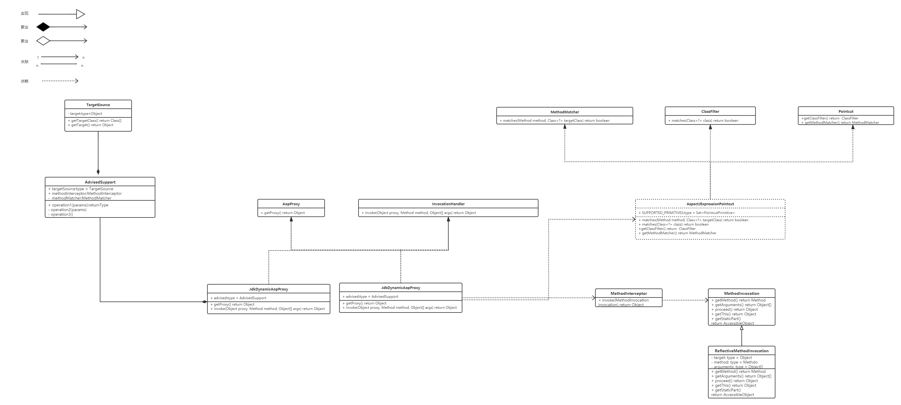

# small-spring

# AOP实现

## 思路整理

AOP 意为：面向切面编程，通过预编译的方式和运行期间动态代理实现程序功能功能的统一维护。关于 AOP 的核心技术实现主要是动态代理的使用，就像你可以给一个接口的实现类，使用代理的方式替换掉这个实现类，使用代理类来处理你需要的逻辑。

在我们平常使用spring提供的AOP功能的时候，我们总是会写一些表达式，来指定我们想要进行AOP环绕的的方法。比如@Around("@annotation(com.heng.test.log.LogProperty)")，Around中@annotation就是aspect表达式，程序会通过该表达式去判断某个对象执行的方法是否是我们需要进行AOP增强的方法，如果是则执行相应的代理方法，如果不是则执行原来方法的逻辑。

因此我们在实现自己的AOP功能的时候，主要需要具备以下两个功能。

* 对切面方法的过滤
* 对切面方法进行代理。

## uml图

## 功能实现

### 对切面方法的过滤

在程序中，我们定义了AspectJExpressionPointcut类来负责对需要被AOP增强的方法的匹配。

定义了TargetSource类，来持有被代理的类

实现了MethodInvocation接口，在方法调用时提供给拦截器

实现了MethodInterceptor接口，对被执行的方法进行拦截

定义了AdvisedSupport类来持有进行一些进行AOP代理时需要用到的类对象的传递。

定义AopProxy接口，来负责对对象的代理。
